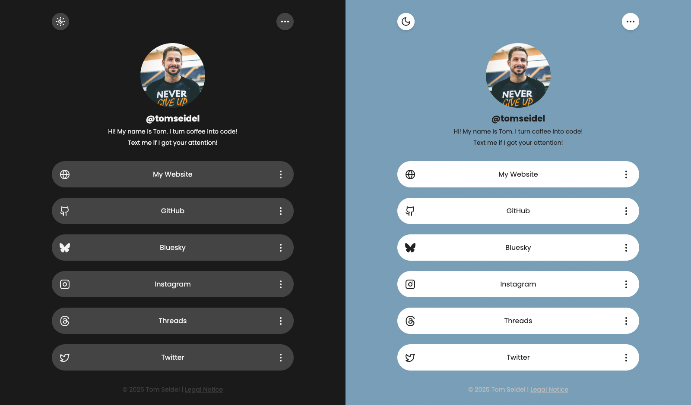

# 🌐 Linktree Clone

A **minimalist and responsive Linktree-style landing page** – ideal for developers who want to showcase their online presence in one centralized place.



---

## ✨ Features

- ✅ **Responsive Design** – Works smoothly on all screen sizes.
- 🛠️ **Easy Customization** – Just edit `index.html` to update your content.
- 🧩 **No Dependencies** – Built with pure HTML, CSS, and JavaScript.
- 🌙 **Dark Mode Support** – Automatically follows the system theme, with manual toggle option included.

---

## 🚀 Getting Started

### 1. Clone the repository

```bash
git clone https://github.com/tom-seidel/linktree-clone.git
cd linktree-clone
